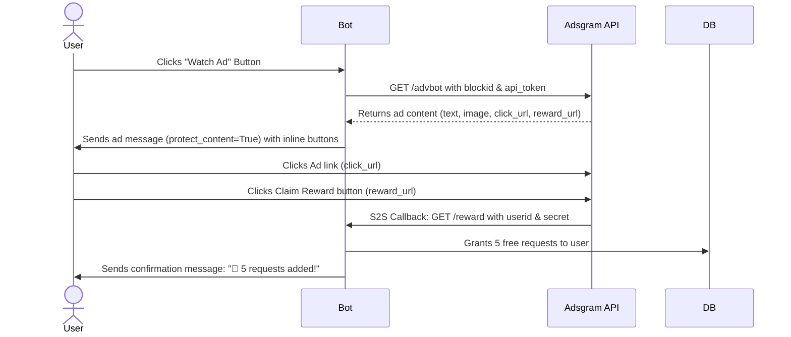

# Adsgram Integration Guide

This guide explains how to register on Adsgram, create an Ad Block, configure the Telegram Bot API (`/advbot`) integration, set up Server-to-Server (S2S) reward callbacks, and configure Nginx to proxy reward webhooks.

---

## 1. Registering on Adsgram

1. Go to the [Adsgram Publisher Dashboard](https://partner.adsgram.ai/).
2. Log in using your Telegram account.
3. In the left sidebar, click on **Platforms**.
4. Click **Add Platform** and select **Telegram Bot**.
5. Fill in your bot's details (username, Bot ID from `@BotFather`, category, description) and submit. Note that your bot must pass moderation before it can display live ads (during development, you can create a platform as "Test" to test integration immediately without moderation).

---

## 2. Creating an Ad Block & Getting API Tokens

1. Navigate to your created platform in the dashboard.
2. Click **Create Ad Block** and choose the **Rewarded Video** format.
3. Save the block. You will get a unique **Block ID** (Unit ID), for example: `12345`.
4. Copy this Block ID and add it to your `.env` file:
   ```env
   ADSGRAM_BLOCK_ID="12345"
   ```
5. Go to your **Profile** (top right corner of the Adsgram dashboard) and copy your **Account API Token** (often labeled as Account Token). This token is required to authenticate bot requests to the Adsgram API.
6. Add this token to your `.env` file:
   ```env
   ADSGRAM_API_TOKEN="your_adsgram_account_api_token"
   ```

---

## 3. Configuring the Reward URL (S2S Callback)

To securely credit users after they watch an ad, Adsgram uses a Server-to-Server (S2S) Callback. To prevent unauthorized requests from minting quota, you must use a shared secret token.

1. **Generate a Shared Secret**: Create a random secure string of your choice (e.g., `my_secure_token_123`).
2. Add this secret to your `.env` file:
   ```env
   ADSGRAM_SECRET="my_secure_token_123"
   ```
3. Go to your Ad Block settings in the Adsgram dashboard.
4. Find the **Reward URL** (or callback URL) field.
5. Enter your public HTTPS URL including both the `[userId]` placeholder and your custom secret token:
   ```
   https://your-domain.com/reward?userid=[userId]&secret=my_secure_token_123
   ```
6. When a reward event occurs, Adsgram will invoke this endpoint, replacing `[userId]` with the Telegram ID but keeping your secret query parameter intact.

---

## 4. How the Bot-Native Ad Flow Works

Instead of opening a Telegram Mini App (Web App), the bot fetches and delivers ads directly within the chat interface:



### Security Requirement: Non-Forwardable Ad Messages
To prevent users from sharing ad messages with others (which violates Adsgram rules), all ad messages are sent with `protect_content=True` (which disables copying, saving, and forwarding of the message).

---

## 5. Nginx Reverse Proxy Setup

Nginx must listen on port 443 (HTTPS) and forward incoming S2S reward callback webhooks (`/reward`) to your Python application.

Since we no longer serve a Mini App Web App, the `/ad` route has been deleted and Nginx only needs to proxy the webhook:

```nginx
server {
    listen 80;
    server_name your-domain.com;
    
    # Redirect HTTP to HTTPS
    return 301 https://$host$request_uri;
}

server {
    listen 443 ssl http2;
    server_name your-domain.com;

    # SSL Certificate Configuration (e.g., Let's Encrypt)
    ssl_certificate /etc/letsencrypt/live/your-domain.com/fullchain.pem;
    ssl_certificate_key /etc/letsencrypt/live/your-domain.com/privkey.pem;
    
    ssl_protocols TLSv1.2 TLSv1.3;
    ssl_ciphers HIGH:!aNULL:!MD5;

    # Route for the Adsgram Reward Callback webhook
    location /reward {
        proxy_pass http://127.0.0.1:8080;
        proxy_set_header Host $host;
        proxy_set_header X-Real-IP $remote_addr;
        proxy_set_header X-Forwarded-For $proxy_add_x_forwarded_for;
        proxy_set_header X-Forwarded-Proto $scheme;

        # Disable access logging to prevent leaking the shared secret token in Nginx logs
        access_log off;
    }
}
```

### Applying Nginx configuration:
1. Save the configuration to `/etc/nginx/sites-available/telegram-bot.conf`.
2. Test configuration: `sudo nginx -t`.
3. Reload Nginx: `sudo systemctl reload nginx`.

---

## 6. Testing the Setup

### Simulate a Reward Webhook:
You can verify the backend database and Telegram notification logic using `curl`:
```bash
curl "https://your-domain.com/reward?userid=YOUR_TELEGRAM_USER_ID&secret=YOUR_SHARED_SECRET"
```
If successful, your bot will message you saying:
`🎉 You have successfully watched the ad! 5 requests have been added to your balance.`
